# Diagram Podróży Użytkownika - Moduł Uwierzytelniania ChairAI

Ten diagram przedstawia kompleksową podróż użytkownika przez moduł uwierzytelniania platformy ChairAI, obejmując wszystkie kluczowe procesy zgodne z wymaganiami PRD i specyfikacją techniczną.

## Przegląd Procesów

Diagram wizualizuje następujące główne procesy:

1. **Proces Logowania** - Użytkownik loguje się na istniejące konto
2. **Proces Rejestracji** - Nowy użytkownik tworzy konto (Klient lub Rzemieślnik)
3. **Proces Odzyskiwania Hasła** - Użytkownik inicjuje reset hasła
4. **Proces Resetu Hasła** - Użytkownik ustawia nowe hasło
5. **Proces Wylogowania** - Zakończenie sesji użytkownika
6. **Middleware Ochrona Tras** - Automatyczna weryfikacja sesji

## Kluczowe Punkty Decyzyjne

- **Wybór typu konta**: Podczas rejestracji użytkownik wybiera rolę (Klient/Rzemieślnik)
- **Walidacja danych**: Sprawdzenie poprawności formularzy po stronie klienta
- **Weryfikacja sesji**: Middleware sprawdza ważność tokenu przy każdym żądaniu
- **Autoryzacja**: Potwierdzenie poświadczeń przez Supabase Auth

## Diagram

```mermaid
stateDiagram-v2
    [*] --> StronaGlowna
    
    state "Strona Główna" as StronaGlowna {
        [*] --> WidokNiezalogowany
        WidokNiezalogowany --> WyborAkcji
        WyborAkcji --> PrzyciskZaloguj: Kliknięcie Zaloguj
        WyborAkcji --> PrzyciskZarejestruj: Kliknięcie Zarejestruj
    }
    
    StronaGlowna --> ProcesLogowania: Użytkownik wybiera logowanie
    StronaGlowna --> ProcesRejestracji: Użytkownik wybiera rejestrację
    
    state "Proces Logowania" as ProcesLogowania {
        [*] --> FormularzLogowania
        FormularzLogowania: Użytkownik wprowadza email i hasło
        note right of FormularzLogowania
            Formularz zawiera:
            - Pole email
            - Pole hasło
            - Link do odzyskiwania hasła
            - Link do rejestracji
        end note
        
        FormularzLogowania --> WalidacjaLogowania: Przycisk Zaloguj
        
        state if_walidacja_login <<choice>>
        WalidacjaLogowania --> if_walidacja_login
        if_walidacja_login --> WeryfikacjaPoswiadczen: Dane poprawne
        if_walidacja_login --> BladWalidacjiLogin: Dane niepoprawne
        
        BladWalidacjiLogin --> FormularzLogowania: Wyświetl błędy
        
        state if_autoryzacja <<choice>>
        WeryfikacjaPoswiadczen --> if_autoryzacja
        if_autoryzacja --> UtworzenieSesji: Poświadczenia OK
        if_autoryzacja --> BladAutoryzacji: Nieprawidłowe dane
        
        BladAutoryzacji --> FormularzLogowania: Komunikat błędu
        
        UtworzenieSesji --> UstawienieCiasteczek
        UstawienieCiasteczek --> [*]
    }
    
    state "Proces Rejestracji" as ProcesRejestracji {
        [*] --> FormularzRejestracji
        FormularzRejestracji: Użytkownik wypełnia dane rejestracyjne
        note right of FormularzRejestracji
            Formularz zawiera:
            - Pole email
            - Pole hasło
            - Pole powtórz hasło
            - Wybór typu konta (Klient/Rzemieślnik)
            - Link do logowania
        end note
        
        FormularzRejestracji --> WyborTypuKonta: Wybór roli
        
        state wybor_roli <<choice>>
        WyborTypuKonta --> wybor_roli
        wybor_roli --> RolaKlient: Klient
        wybor_roli --> RolaRzemieślnik: Rzemieślnik
        
        RolaKlient --> WalidacjaDanychRejestracji
        RolaRzemieślnik --> WalidacjaDanychRejestracji
        
        state if_walidacja_rejestracja <<choice>>
        WalidacjaDanychRejestracji --> if_walidacja_rejestracja
        if_walidacja_rejestracja --> WywolanieSupabaseSignUp: Dane poprawne
        if_walidacja_rejestracja --> BladWalidacjiRejestracja: Dane niepoprawne
        
        BladWalidacjiRejestracja --> FormularzRejestracji: Wyświetl błędy
        
        state if_utworzenie_konta <<choice>>
        WywolanieSupabaseSignUp --> if_utworzenie_konta
        if_utworzenie_konta --> fork_rejestracja: Sukces
        if_utworzenie_konta --> BladRejestracji: Użytkownik istnieje
        
        BladRejestracji --> FormularzRejestracji: Komunikat błędu
        
        state fork_rejestracja <<fork>>
        fork_rejestracja --> WyslanieMailaWeryfikacyjnego
        fork_rejestracja --> AutomatyczneLogowanie
        
        state join_rejestracja <<join>>
        WyslanieMailaWeryfikacyjnego --> join_rejestracja
        AutomatyczneLogowanie --> join_rejestracja
        
        join_rejestracja --> [*]
    }
    
    ProcesLogowania --> PanelUzytkownika: Sesja utworzona
    ProcesRejestracji --> PanelUzytkownika: Auto-logowanie
    
    FormularzLogowania --> ProcesOdzyskiwaniaHasla: Link Nie pamiętasz hasła
    
    state "Proces Odzyskiwania Hasła" as ProcesOdzyskiwaniaHasla {
        [*] --> FormularzOdzyskiwania
        FormularzOdzyskiwania: Użytkownik podaje email
        note right of FormularzOdzyskiwania
            Formularz zawiera:
            - Pole email
            - Link powrotu do logowania
        end note
        
        FormularzOdzyskiwania --> WalidacjaEmail: Przycisk Wyślij
        
        state if_email <<choice>>
        WalidacjaEmail --> if_email
        if_email --> WywolanieResetPasswordForEmail: Email poprawny
        if_email --> BladWalidacjiEmail: Email niepoprawny
        
        BladWalidacjiEmail --> FormularzOdzyskiwania: Wyświetl błąd
        
        WywolanieResetPasswordForEmail --> WyslanieLinkuResetu
        WyslanieLinkuResetu --> KomunikatSukcesu
        note right of KomunikatSukcesu
            Zawsze wyświetlamy sukces
            aby uniknąć enumeracji użytkowników
        end note
        
        KomunikatSukcesu --> [*]
    }
    
    ProcesOdzyskiwaniaHasla --> ProcesResetuHasla: Kliknięcie linku w mailu
    
    state "Proces Resetu Hasła" as ProcesResetuHasla {
        [*] --> WeryfikacjaTokena
        
        state if_token <<choice>>
        WeryfikacjaTokena --> if_token
        if_token --> FormularzNowegoHasla: Token ważny
        if_token --> BladTokenu: Token nieważny
        
        BladTokenu --> KomunikatBleduTokenu
        KomunikatBleduTokenu --> [*]
        
        FormularzNowegoHasla: Użytkownik ustawia nowe hasło
        note right of FormularzNowegoHasla
            Formularz zawiera:
            - Pole nowe hasło
            - Pole powtórz hasło
        end note
        
        FormularzNowegoHasla --> WalidacjaNowegoHasla: Przycisk Zmień hasło
        
        state if_haslo <<choice>>
        WalidacjaNowegoHasla --> if_haslo
        if_haslo --> ZapisNowegoHasla: Hasła zgodne
        if_haslo --> BladWalidacjiHasla: Hasła niezgodne
        
        BladWalidacjiHasla --> FormularzNowegoHasla: Wyświetl błąd
        
        ZapisNowegoHasla --> KomunikatZmianyHasla
        KomunikatZmianyHasla --> [*]
    }
    
    ProcesResetuHasla --> ProcesLogowania: Hasło zmienione
    
    state "Panel Użytkownika" as PanelUzytkownika {
        [*] --> SprawdzenieRoli
        
        state if_rola <<choice>>
        SprawdzenieRoli --> if_rola
        if_rola --> DashboardKlienta: Klient
        if_rola --> DashboardRzemieślnika: Rzemieślnik
        
        DashboardKlienta: Główny widok klienta
        note right of DashboardKlienta
            Zawiera:
            - Generator AI
            - Moje projekty
            - Historia generacji
            - Menu profilu z opcją Wyloguj
        end note
        
        DashboardRzemieślnika: Główny widok rzemieślnika
        note right of DashboardRzemieślnika
            Zawiera:
            - Marketplace projektów
            - Moje propozycje
            - Portfolio
            - Menu profilu z opcją Wyloguj
        end note
        
        DashboardKlienta --> AkcjaWylogowania: Kliknięcie Wyloguj
        DashboardRzemieślnika --> AkcjaWylogowania: Kliknięcie Wyloguj
    }
    
    state "Proces Wylogowania" as ProcesWylogowania {
        [*] --> AkcjaWylogowania
        AkcjaWylogowania --> WywolanieSignOut
        WywolanieSignOut --> UsunięcieCiasteczek
        UsunięcieCiasteczek --> ZakonczenieSesji
        ZakonczenieSesji --> [*]
    }
    
    PanelUzytkownika --> ProcesWylogowania
    ProcesWylogowania --> StronaGlowna: Przekierowanie
    
    state "Middleware Ochrona Tras" as MiddlewareOchrona {
        [*] --> SprawdzenieSesji
        
        state if_sesja <<choice>>
        SprawdzenieSesji --> if_sesja
        if_sesja --> WeryfikacjaTokenu: Token istnieje
        if_sesja --> BrakSesji: Brak tokenu
        
        state if_token_valid <<choice>>
        WeryfikacjaTokenu --> if_token_valid
        if_token_valid --> UzytkownikZweryfikowany: Token ważny
        if_token_valid --> ProbaOdswiezenia: Token wygasł
        
        state if_refresh <<choice>>
        ProbaOdswiezenia --> if_refresh
        if_refresh --> AktualizacjaCiasteczek: Refresh OK
        if_refresh --> BrakSesji: Refresh błąd
        
        AktualizacjaCiasteczek --> UzytkownikZweryfikowany
        
        note right of UzytkownikZweryfikowany
            Dane użytkownika w Astro.locals.user
            Dostęp do chronionych tras
        end note
        
        BrakSesji: Użytkownik niezalogowany
        note right of BrakSesji
            Przekierowanie do /login
            dla chronionych tras
        end note
    }
    
    note left of MiddlewareOchrona
        Middleware wykonywane
        na każde żądanie HTTP
        zarządza sesją i ochroną tras
    end note
    
    StronaGlowna --> [*]: Koniec sesji
```

## Mapowanie do Historyjek Użytkownika

- **US-001**: Proces Rejestracji → Wybór roli Klient
- **US-002**: Proces Logowania → Panel Użytkownika
- **US-003**: Proces Wylogowania → Strona Główna
- **US-009**: Proces Rejestracji → Wybór roli Rzemieślnik

## Techniczne Elementy Implementacji

### Komponenty Frontend (React)
- `LoginForm.tsx` - Formularz logowania
- `RegisterForm.tsx` - Formularz rejestracji z wyborem roli
- `PasswordRecoveryForm.tsx` - Formularz odzyskiwania hasła
- `PasswordResetForm.tsx` - Formularz resetowania hasła

### Strony (Astro)
- `/login.astro` - Strona logowania
- `/register.astro` - Strona rejestracji
- `/password-recovery.astro` - Strona odzyskiwania hasła
- `/password-reset.astro` - Strona resetowania hasła

### API Endpoints
- `POST /api/auth/login` - Logowanie użytkownika
- `POST /api/auth/register` - Rejestracja użytkownika
- `POST /api/auth/logout` - Wylogowanie użytkownika
- `POST /api/auth/password-recovery` - Inicjacja resetu hasła
- `GET /api/auth/callback` - Obsługa callbacku Supabase

### Middleware
- `src/middleware/index.ts` - Zarządzanie sesją i ochrona tras

## Notatki Bezpieczeństwa

1. **Tokeny sesji** przechowywane w bezpiecznych ciasteczkach HTTP-only
2. **Refresh tokeny** używane do automatycznego odnawiania sesji
3. **Walidacja po stronie serwera** dla wszystkich endpointów API
4. **Ochrona przed enumeracją** w procesie odzyskiwania hasła
5. **Przekierowania** dla niezalogowanych użytkowników na chronionych trasach
